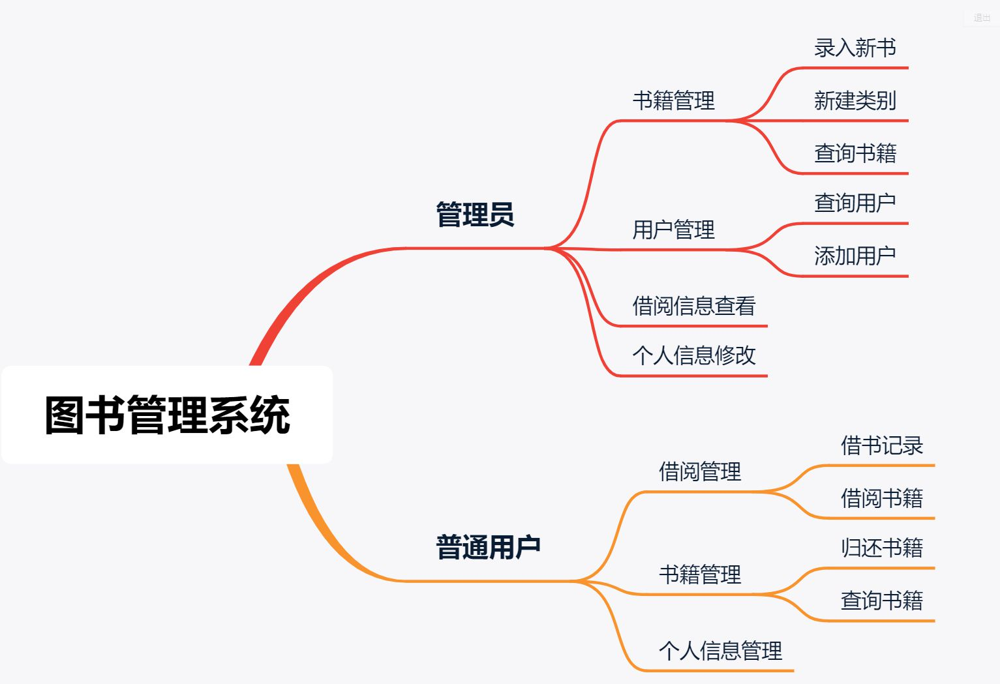

# springboot-libraryManageSystem

>  图书管理系统 ，使用 SpringBoot 框架。

##  一、相关技术栈

1. **前端:** Thymeleaf、Layui、Ajax、JQuery
2. **后端:**  SpringBoot、MyBatis 
3. **开发环境:** jetBrains Intellij IDEA 、SpringBoot 2.3、Maven
4. **数据库:** MySQL、avicat

### 默认用户

当您运行初始脚本后，默认存在以下用户，便于测试：

| 登录名   | 密码     | 用户角色 |
|:------|:-------| :------ |
| PYS   | 114514 | 普通用户 |
| 德川 | 123456 | 普通用户 |
| admin | 123456 |  管理员  |

## 二、主要功能

## 三、数据库表结构设计  
